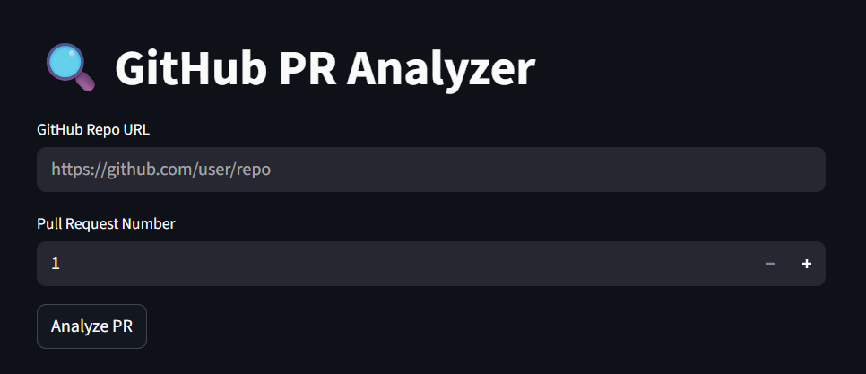

# AI-PR-Reviewer

An intelligent assistant that automatically reviews GitHub pull requests using LangChain and GPT-4. It performs deep analysis on PR diffs and provides feedback on:

- Code style and formatting issues  
- Potential bugs or logic errors  
- Performance improvement suggestions  
- Best practice violations  

---

## Features

- FastAPI-based backend for API and task orchestration  
- LangChain-powered analysis pipeline using GPT-4  
- Celery + Redis for background processing  
- Streamlit frontend to trigger and visualize PR reviews  
- Rate limiting and caching using Redis  
- Modular design for future agent/tool integrations  

---

## Project Setup Instructions

### 1. Clone the repository

```bash
git clone https://github.com/SamarthKumbar/AI-PR-Reviewer.git
cd AI-PR-Reviewer
```

### 2. Set up virtual environment

```bash
python -m venv venv
source venv/bin/activate  # On Windows: venv\Scripts\activate
```

### 3. Install dependencies

```bash
pip install -r requirements.txt
```

### 4. Environment setup

Create a `.env` file using the provided template:

```
REDIS_URL=""
API_KEY=""
```

---

## Running the System

### Backend API (FastAPI)

```bash
uvicorn app.main:app --reload --port 8002
```

### Background Task Worker (Celery)

```bash
celery -A app.celery_worker worker --loglevel=info --pool=solo
```

### Redis Server (Docker)

```bash
docker run -p 6379:6379 redis
```

### Streamlit Frontend

```bash
streamlit run UI.py
```

---

## API Documentation

### POST `/analyze-pr`

Trigger PR review.

**Request**:

```json
{
  "repo_url": "https://github.com/user/repo",
  "pr_number": 123
}
```

**Response**:

```json
{
  "task_id": "abc123"
}
```

### GET `/status/{pr_number}`

Check PR analysis status.

### GET `/results/{pr_number}`

Retrieve analysis results.

---

## Running Tests

```bash
pytest
```

Tests are located in the `tests/` folder and include:

- API status code checks  
- Caching and rate limit validations  
- PR diff analysis mock testing  

---

## Design Decisions

- Redis caching for repeated PRs to reduce latency  
- Rate limiting per IP to avoid abuse  
- Background task queue (Celery) ensures non-blocking behavior  
- Streamlit UI provides instant usability for testing and demo  

---

## Future Improvements

- OAuth support for secure GitHub integration  
- Use LangChain agents for file-by-file analysis  
- Add review score and risk metric per PR  
- Automatically comment review on GitHub PR  
- LLM finetuning or RAG for enterprise-level performance  
- CI/CD integration and better test coverage  

